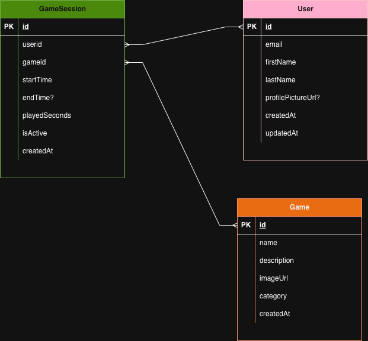

# 🎮 Game Timer

A fun accessible game time tracker for users, games, and sessions.  
Track your playtime, view statistics, and compete on the leaderboard!

This project was built as a backend school assignment at Sundsgården Folkhögskola in 2025.
Focusing on RESTful API design, MongoDB integration, and TypeScript best practices.

---

_Registration & timetracking flow demonstration_


_User statistics dashboard demonstration_

## 

---

## 🚀 What It Does

- **Register:** Create a user profile with avatar.
- **Games:** Browse and select retro games to play.
- **Play:** Start a session, track your playtime with a retro timer.
- **Stats:** View personal and global statistics, charts, and leaderboards.
- **Users:** Search and view all registered users.
- **Search Function:** Quickly find users with the global search bar.
- **Weather Widget:** See live weather updates in the header.

---

## 🗂️ Pages

- `/register` — User registration
- `/games` — Game selection
- `/play/:gameId` — Play a game and track time
- `/stats/:userId` — Personal and global statistics
- `/users` — User search and profiles

---

## 🗄️ Database Functions

See the ERD below for relationships:



- **User:** Stores user info and profile picture
- **Game:** Stores game info and icons
- **GameSession:** Tracks play sessions, time played, and links to user/game

---

## 🛠️ Tech Stack

- **Frontend:** React, TypeScript, Tailwind CSS, Chart.js
- **Backend:** Node.js, Express, MongoDB
- **APIs:** RESTful endpoints for users, games, sessions, statistics
- **Weather:** OpenWeatherMap API for live weather widget

---

## 🏁 Quick Start

**Prerequisites:**

- Node.js & npm installed
- Docker installed (runs MongoDB automatically)

**Setup:**

1. Clone the repo
2. `npm install` (installs both frontend & backend)
3. `npm run seed` (seed 4 games to database)
4. `./dev.sh` (starts Docker, backend, and frontend)

**Open:** http://localhost:5173

**To See Data in Action:**

1. Register a user (go to `/register`)
2. Select the user on the Games page
3. Play a game and log some time
4. View stats on the Stats page

**Alternatively (Manual - without Docker):**

```bash
# Terminal 1 - Backend
cd backend && npm install && npm run dev

# Terminal 2 - Frontend
cd frontend && npm install && npm run dev
```

---

Credits: Shared effort by @s-weberg and @TrooperLooper

**Enjoy tracking your game time and climbing the leaderboard!**
